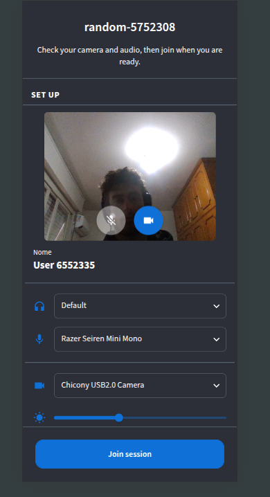
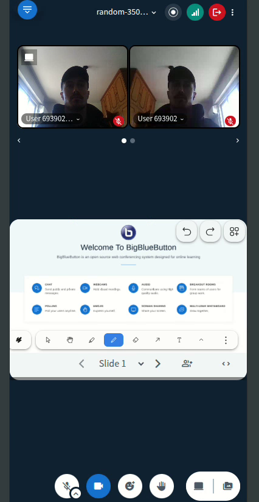
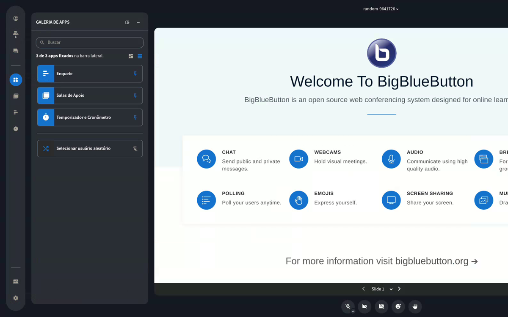
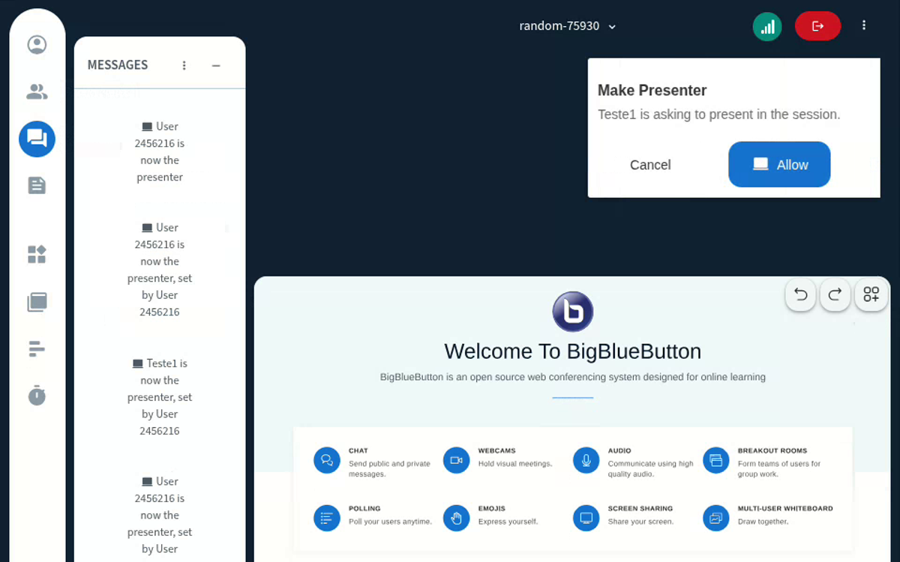

### Hi, I'm Átila Uebel

[LinkedIn](https://www.linkedin.com/in/atila-uebel) · atilauebel2000@gmail.com

**80+ merged PRs in BigBlueButton upstream** · 45 in the BBB Mobile SDK · contributing since 2023

Software developer on the **Live team at [Mconf](https://github.com/mconf)**, where I work on the core of the videoconferencing platform behind Elos and ConferênciaWeb (RNP), used by educational institutions across Brazil. The platform is built on **[BigBlueButton](https://github.com/bigbluebutton/bigbluebutton)**, the open-source web conferencing system, and Mconf is one of its core contributors.

Since 2023 I've been contributing to BigBlueButton upstream: building features, reviewing code and helping triage issues.

I'm also an MSc student in Computer Science at UFRGS, focusing on **High-Performance Computing**.

#### Selected BigBlueButton contributions

- **Pre-join setup screen**: configure audio and video before entering the session ([#25774](https://github.com/bigbluebutton/bigbluebutton/pull/25774))
- **Mobile layout overhaul**: paginated webcams, compact bars and responsive dialogs ([#25340](https://github.com/bigbluebutton/bigbluebutton/pull/25340))
- **Native dark theme**: replaced the DarkReader library with a CSS-based theme ([#25763](https://github.com/bigbluebutton/bigbluebutton/pull/25763))
- **"Request to become presenter"** flow for viewers ([#24341](https://github.com/bigbluebutton/bigbluebutton/pull/24341))
- **Join request metadata for webhooks**, with hardened client IP extraction ([#24451](https://github.com/bigbluebutton/bigbluebutton/pull/24451))
- **[BBB Mobile SDK](https://github.com/mconf/bbb-mobile-sdk)**: 45 merged PRs on Mconf's open-source mobile client for BigBlueButton (Expo / React Native)
- **[Custom Feedback](https://github.com/bigbluebutton/custom-feedback)**: 8 merged PRs on the customizable feedback form (Vite migration, deploy-time form definition, feedback capture on page leave)

<b>Screenshots</b>

 
<table>
  <tr>
    <td width="50%" align="center" valign="top">
      
       <b>Pre-join setup screen</b> · <a href="https://github.com/bigbluebutton/bigbluebutton/pull/25774">#25774</a>
    </td>
    <td width="50%" align="center" valign="top">
      
       <b>Mobile layout overhaul</b> · <a href="https://github.com/bigbluebutton/bigbluebutton/pull/25340">#25340</a>
    </td>
  </tr>
  <tr>
    <td width="50%" align="center" valign="top">
      
       <b>Native dark theme</b> · <a href="https://github.com/bigbluebutton/bigbluebutton/pull/25763">#25763</a>
    </td>
    <td width="50%" align="center" valign="top">
      
       <b>"Request to become presenter"</b> · <a href="https://github.com/bigbluebutton/bigbluebutton/pull/24341">#24341</a>
    </td>
  </tr>
</table>

[All my merged PRs in BigBlueButton →](https://github.com/bigbluebutton/bigbluebutton/pulls?q=is%3Apr+author%3AAtilaU19+is%3Amerged)

#### Stack

**Frontend:** React · TypeScript · JavaScript · CSS\
**Backend:** Node.js\
**Infra & tools:** Docker · Linux · Git\
**HPC:** C · CUDA
